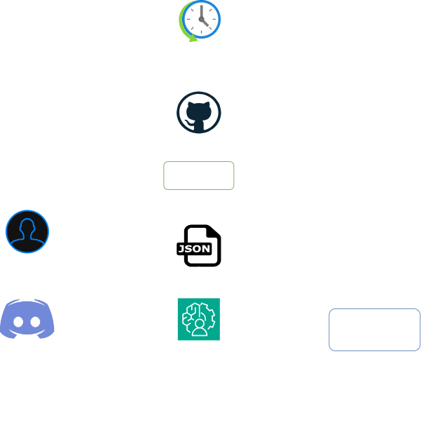

# Stack Feed

Stack feed is a weekly AI digest bot for the Discord community. It collects recent AI updates from leading company blogs, web pages, news articles, and selected newsletters, summarizes them into valuable points and sends the weekly digest to Discord (every Sunday at 10 a.m). It is beneficial for AI engineers who want to keep up with AI developments in this continuously evolving market.

It is also powered by a hybrid RAG pipeline over the latest digest content. It stores semantic and keyword-searchable chunks in Qdrant, answers from retrieved context only, and posts evaluation metrics after the Q&A window closes.

## Project Features

- Fetches weekly AI updates from RSS feeds, non-RSS pages, and Gmail newsletters.
- Categorizes company-feed articles with semantic chunk and title similarity into model release, safety, product/tooling, research, general, or filtered categories.
- Summarizes each article with Groq-hosted LLMs (openai/gpt-oss120b).
- Posts categorized digest embeds to a Discord channel. Opens a two-hour Q&A window after each digest.
- Creates per-user Discord threads for follow-up questions.
- Uses Qdrant hybrid retrieval with dense embeddings (all-MiniLM-L6-v2) and BM25 sparse retrieval.
- Continuously tracks RAG quality metrics such as latency, context relevance, groundedness, answer relevance, low context relevance queries, unsupported groundedness queries, irrelevant answer relevance queries, and sends to the Discord channel after Q&A.
- Uploads bot logs as a GitHub Actions artifact.

## Architecture


## How It Works

1. `processing/summarizer.py` loads sources from `fetcher/config.json` and category anchors from `processing/anchor_config.json`.
2. `fetcher/feed_fetcher.py` collects recent blog posts from RSS feeds and configured non-RSS pages.
3. `fetcher/gmail_fetcher.py` collects recent newsletters from configured senders.
4. `processing/article_categorizer.py` semantically chunks company-feed articles, compares their content and titles with category anchors, and selects the categories included in the digest.
5. Categorized articles and separately grouped newsletters are written to `latest_news.json`.
6. Groq summarizes each article into 3 to 5 concise bullet points using its category as context.
7. `rag/hybrid_rag.py` chunks the raw article content and uploads dense plus sparse vectors to Qdrant.
8. `discord_bot.py` posts the categorized digest and answers questions inside user threads.
9. `rag/rag_eval.py` evaluates answer quality and sends a metrics embed when the Q&A window closes.


## Setup & Execution

1. Clone the repository
   ```bash
   git clone https://github.com/itsmoksh/stack-feed.git
   cd stack-feed
   ```
2. Install dependencies
    ```powershell
    uv sync
    ```
   
3. Set up Gmail and Discord Credentials:
   - For setting up Gmail Credentials, refer to this: [Fetcher Readme](fetcher/README.md)
   - For getting Discord Credentials:
     - Go to [Discord Developer's Portal](https://discord.com/developers/applications) and log in with your discord account.
     - Click on create **New Application**, and name it.
     - On the left sidebar, click on **Bot**, add details and click on reset token to get the **Discord Token**.
     - Now go to **OAuth2**, scroll down to 'OAuth2 URL Generator' and choose **Bot**.
     - Scroll down to Bot permissions, and under text messages select:
       1. Send Messages
       2. Create Public Thread
       3. Send Messages in Threads.
       4. Embed Links
       5. Attach Files, and copy the generated url to call the bot.
     - Enable the Developers option in your Discord account, and then you will be able to copy the channel IDs.

4. Create a `.env` file in the project root:

    ```text
    DISCORD_TOKEN=your_discord_bot_token
    DIGEST_CHANNEL_ID=your_digest_channel_id
    METRICS_CHANNEL_ID=your_metrics_channel_id
    GROQ_API_KEY=your_groq_api_key
    QDRANT_URL=your_qdrant_cloud_url
    QDRANT_API_KEY=your_qdrant_api_key
    HF_TOKEN=your_huggingface_token
    ```

The fetcher keeps articles from the last seven days. The processing layer then scores company-feed articles against five semantic anchors: `Model Release`, `Safety`, `Product/Tooling`, `Business/Company`, and `Research`. Ambiguous articles can become `General`; the current digest selection excludes `Business/Company` and low-confidence `Uncategorized` articles. Gmail newsletters bypass semantic categorization and are stored under `newsletter`.

---
## Run Locally

Run the full Discord bot:

   ```bash
   uv run python discord_bot.py
   ```

## GitHub Actions

The workflow in `.github/workflows/weekly-bot.yml` can be started manually with `workflow_dispatch`.

Add these repository secrets before running it:

```text
DISCORD_TOKEN
DIGEST_CHANNEL_ID
METRICS_CHANNEL_ID
GROQ_API_KEY
QDRANT_URL
QDRANT_API_KEY
HF_TOKEN
GMAIL_CREDENTIALS_JSON_B64
GMAIL_TOKEN_JSON_B64
```

The Gmail secrets should be base64-encoded versions of `fetcher/gmail_credentials.json` and `fetcher/token.json`.

## Project Structure

```text
stack-feed/
|-- .github/workflows/weekly-bot.yml  # Manual GitHub Actions runner
|-- discord_bot.py                    # Discord digest and Q&A bot
|-- logging_setup.py                  # Shared file logger setup
|-- README.md                         # README file
|-- assets/
|   |-- fetcher_workflow.png          # Workflow diagram of Fetcher
|   |-- overall_workflow.png          # Overall workflow diagram
|   |-- rag_workflow.png              # Workflow diagram of RAG
|-- fetcher/
|   |-- config.json                   # Source configuration
|   |-- feed_fetcher.py               # RSS and non-RSS article extraction
|   |-- gmail_fetcher.py              # Gmail newsletter extraction
|   |-- README.md                     # Fetcher README
|-- processing/
|   |-- anchor_config.json            # Semantic category examples
|   |-- article_categorizer.py        # Article classification and selection
|   |-- summarizer.py                 # Pipeline orchestration and summarization
|   |-- README.md                     # Processing README
|-- rag/
|   |-- hybrid_rag.py                 # Dense + sparse Qdrant retrieval
|   |-- rag_eval.py                   # RAG evaluation metrics
|   |-- README.md                     # RAG README

```
**Moksh Jain**

**Credits:** OpenAI, Anthropic, DeepMind, The Batch Newsletter

[LinkedIn](https://www.linkedin.com/in/itsmoksh/) | [GitHub](https://github.com/itsmoksh) | [Portfolio](https://codebasics.io/portfolio/Moksh-Jain)
