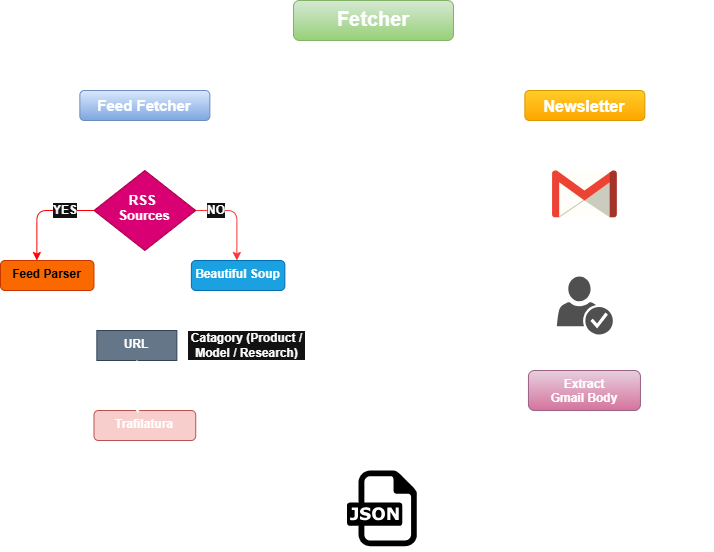

# Fetcher Component - Stack Feed

The fetcher is the first component of StackFeed, that automatically fetches the weekly latest articles, blogs, and news from Multiple sources such as RSS feeds, non-RSS feeds, newsletters from Gmail.  It serves as the data collection layer that gathers raw content before it's summarized and presented to users.

## Overview
There are 2 types of Fetchers:
1. **Gmail Fetcher** - Extract newsletters from your Gmail inbox
2. **Feed Fetcher** - Collect articles from AI company RSS feeds and custom sources

Defined a config.json where all the sources their URLs and fetch type are stored. You can also update them based on your preference.
All fetched articles are aggregated and stored in a latest_news.json file, which is then passed to the Summarizer component.

---
## Architecture

## Components
### 1. Gmail Fetcher:

**File:** `feed_fetcher.py`

Fetches newsletters directly from your Gmail inbox using the Gmail API.

#### Setup Gmail credentials
- Go to google developers console (https://console.cloud.google.com/)
- Select one of the existing project, or create a new one
- Got to APIs and Services and search for Gmail API in library and enable it
- Go to credentials at the left sidebar, and configure consent screen, if not done before.
    - Enter the app name, user support email in the **App Information** and click next
    - Either choose internal or external for audience
    - Mention down your Email address in contact information
    - Click on Finish and Create
- Go to **Create 0Auth client** and choose the application type as **Web Application**
- Enter name, and click on create.
- A pop-up will apper, OAuth client created. Download the JSON file and store it as gmail_credentials.json inside fetcher ('fetcher/gmail_credentials.json')

#### Working
1. Authenticates with Gmail API using OAuth credentials and create tokens.
2. Queries your inbox for emails from specified senders with a since date.
3. Parses email content to extract articles
4. Returns structured article data along with title, content and source.

---
### 2. Feed Fetcher
**File:** `feed_fetcher.py`

Collect Articles, blogs directly from the AI company's website. 

#### Supported Sources:
**RSS Sources**: Fetches all the weekly article URLs directly using feed parser.
- OpenAI 
- Deep Mind 

**Non RSS Sources**: Fetches weekly article URLs using Beautiful Soup.
- Anthropic Newsroom.

#### Working
1. Fetches RSS feeds from the company's websites using Feed Parser.
2. Extracts article URLs from the Non RSS sources.
3. Filter them by category (Product, Models, Research) and published date.
4. Extract article content using Trafilatura.

