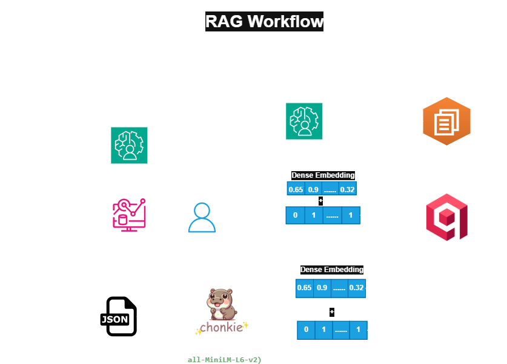

# RAG Component - Stack Feed

The RAG (Retrieval Augmented Generation) Pipeline is an intelligent Q&A system of Stack Feed designed to ask questions about the weekly AI news digest and receive accurate, grounded answers using a hybrid semantic search and a Large language model.

### How it works:
- Loads the categorized raw articles and newsletters from `latest_news.json`, preserving each item's processing category as Qdrant metadata.
- Chunk the article contents using Chonkie based on semantic similarity.
- Ingest these chunks into the Qdrant database as a dense embedding(all-MiniLM-L6-v2) and a sparse embedding(BM25). 
- Find the top 3 article chunks based on the similarity with the user query(hybrid search). 
- Generate structure and human-readable output using the Groq llama-3.3-70b-versatile model. 
- The system evaluates the RAG pipeline using three semantic evaluation categories powered by an LLM-as-a-judge approach.

**1. Retrieval Quality**:
Evaluates whether the retrieved context contains sufficient information to answer the user query, and categorizes into:
- HIGH
- MEDIUM
- LOW 

Tracks: Queries where the retrieval context was insufficient.

**2. Grounding Quality (Faithfulness)**:
Evaluates whether the generated response is supported by the retrieved context, and categorizes into:
- SUPPORTED
- PARTIALLY SUPPORTED
- UNSUPPORTED

Tracks: Queries where responses may contain hallucinated or unsupported information.

**3. Answer Quality (Response Relevance)**:
Evaluates whether the generated response appropriately answers the user query, and categorizes into:
- RELEVANT
- PARTIALLY RELEVANT
- IRRELEVANT

Tracks: Queries where responses were incomplete, vague, or off-topic.

## Architecture


## RAG Requirements:
You need to create a cluster on the Qdrant vector database
- Create an API and URL for that cluster 
- To prevent limit, also create a Hugging Face token
- Store it in a .env file present in the project root
```text
    QDRANT_URL=your_qdrant_cloud_url
    QDRANT_API_KEY=your_qdrant_api_key
    HF_TOKEN=your_huggingface_token
    GROQ_API_KEY=your_groq_api_key
```
